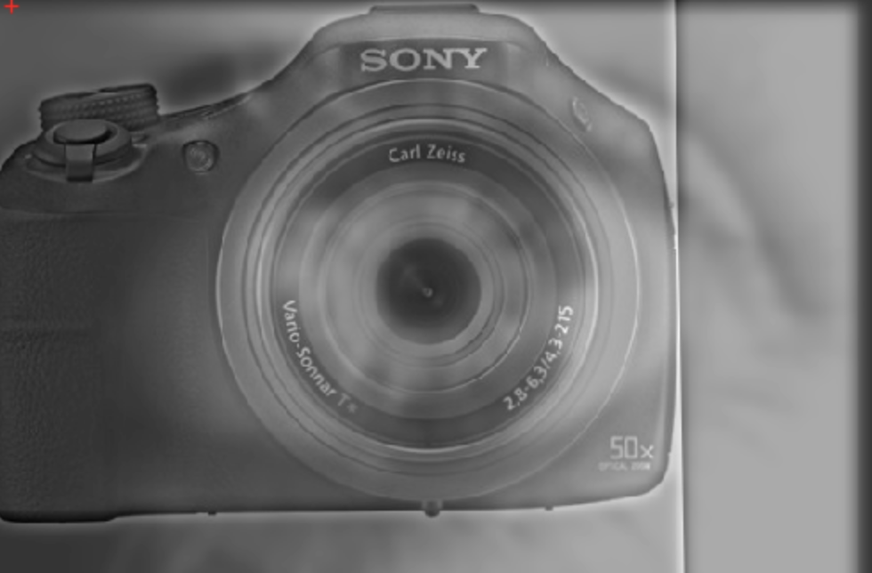
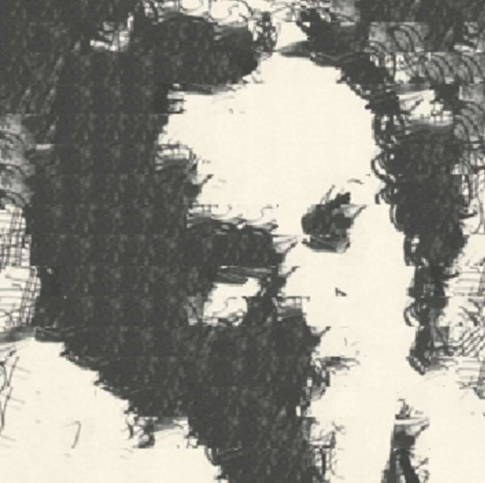
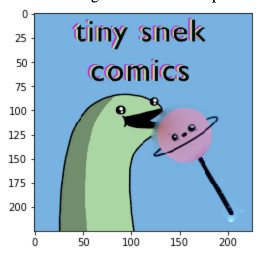
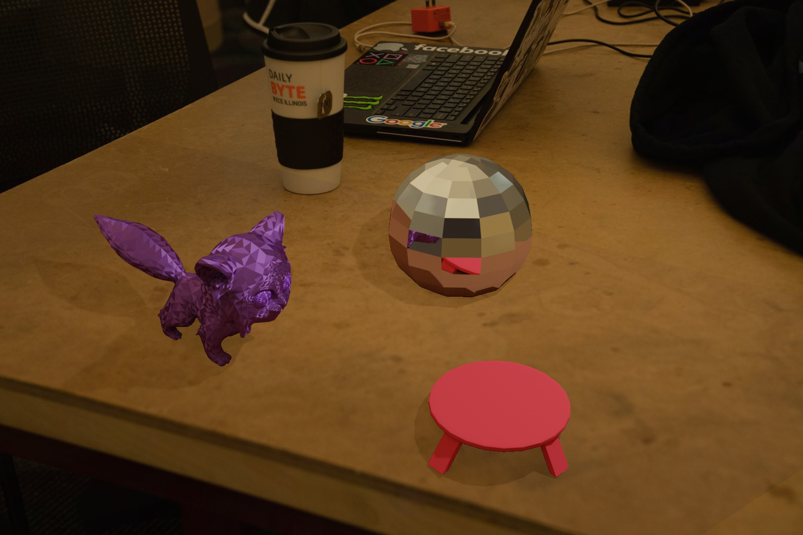
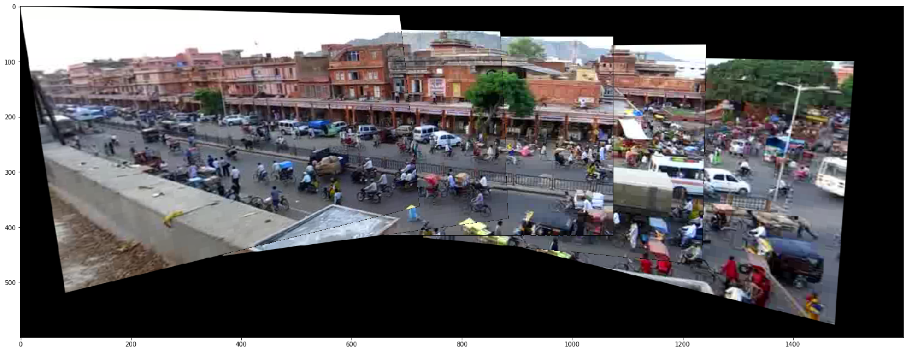

# photoshop-and-rendering-tools
## CS 445: Computational Photography Projects

### Project #1: Hybrid Images http://kazukis2.web.illinois.edu/cs445/proj1/index.html 
### Project #2: Image Quilting http://kazukis2.web.illinois.edu/cs445/proj2/index.html 
### Project #3: Gradient-Domain Fusion http://kazukis2.web.illinois.edu/cs445/proj3/index.html 
### Project #4: Image-Based Lighting http://kazukis2.web.illinois.edu/cs445/proj4/index.html 
### Project #5: Video Stitching & Processing http://kazukis2.web.illinois.edu/cs445/proj5/index.html 

## Project #1: Hybrid Images 

## Project #2: Image Quilting

## Project #3: Gradient-Domain Fusion

## Project #4: Image-Based Lighting 

## Project #5: Video Stitching and Processing

